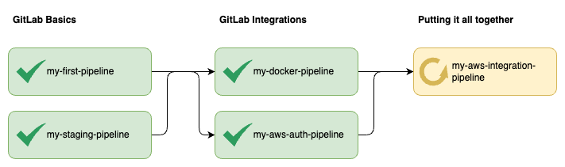
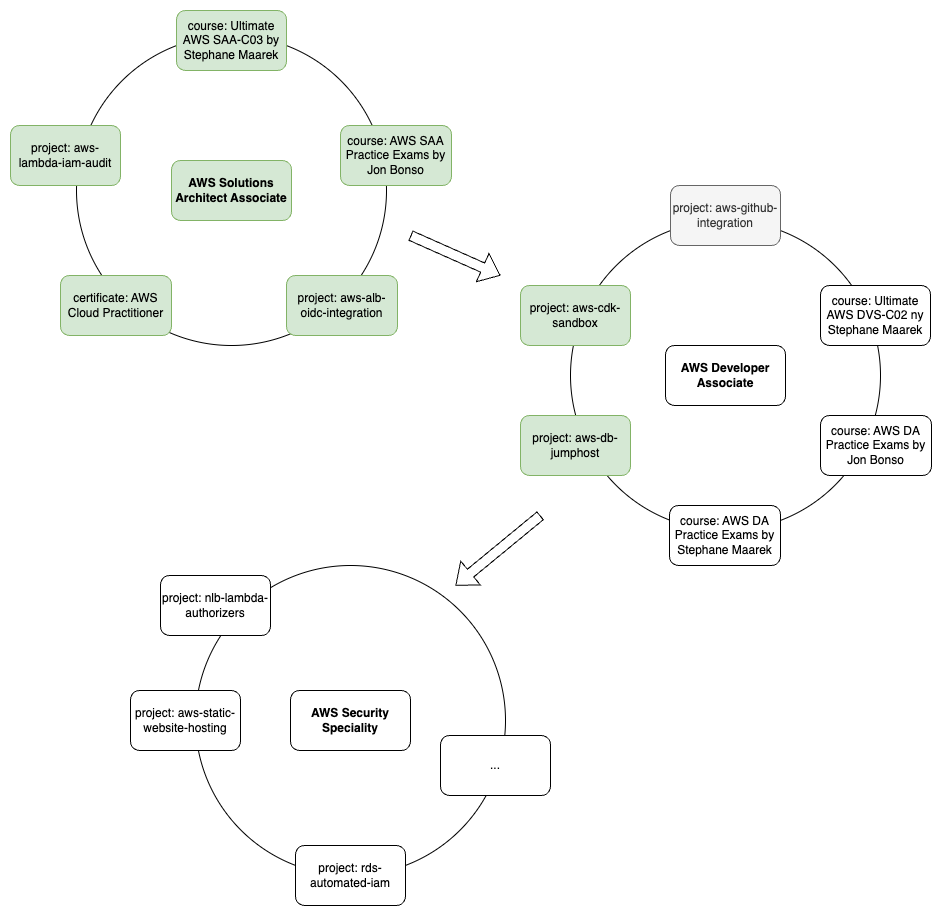

# software-architecture-journey

This repository aims to serve as a summary of topics that I believe are crucial for aspiring architects. It encompasses my personal approaches to learning about these subjects through the implementation of small projects and practical exercises.

---

## Table of contents:
- [The T-Profile](#the-t-profile)
- [Programming & Scripting](#programming-and-scripting)
- [Computer Science Basics](#computer-science-basics)
- [Process Automation](#process-automation)
- [Architecture Patterns & Software Design](#architecture-patterns-and-software-design)
- [Cloud Platforms](#cloud-platforms)
- [Software Systems](#software-systems)

---

## The T-Profile
The T-Profile visualizes my concept of a software architect's skill profile. The horizontal bar of the "T" represents the breadth of knowledge that a software architect should possess. It signifies the ability to comprehend and integrate multiple areas within information technology, such as software development methodologies, system architecture, security, databases, networking, and user experience design. The vertical bar of the "T" symbolizes the depth of expertise in a specific domain. Architects focus on acquiring advanced knowledge and skills in one particular area, becoming specialists in fields like cloud computing, mobile applications, artificial intelligence, data analytics, or enterprise systems.

By combining breadth and depth, the T-Profile represents a well-rounded software architect. They possess the ability to comprehend the bigger picture of software systems while also providing expert guidance in a specific domain.

The following sections will provide an overview of the projects, exercises, and other resources that I have engaged with to enhance my understanding of specific domains. 

## Programming & Scripting
Having programming basics as a software architect is important because it provides a fundamental understanding of the underlying technology, enabling effective communication with developers, accurate assessment of technical feasibility, and informed decision-making in architectural designs.

The diagram shows some projects that I worked on and summarizes how they contributed to me gaining a better understanding of the respective domain.

- https://github.com/mykingdomforapawn/simple-portfolio
- https://github.com/mykingdomforapawn/refactored-portfolio
- https://github.com/mykingdomforapawn/shell-script-automation

## Computer Science Basics
tbd

## Process Automation
Process automation is vital for optimizing software development workflows, making it an essential skill for architects. CI/CD and DevOps practices, in particular, play crucial roles and should be taken into account when designing systems. 

This diagram illustrates several projects undertaken to gain familiarity with these practices and accumulate valuable experience.

- https://gitlab.com/cicd-sandbox1/my-first-pipeline
- https://gitlab.com/cicd-sandbox1/my-staging-pipeline
- https://gitlab.com/cicd-sandbox1/my-aws-auth-pipeline
- https://gitlab.com/cicd-sandbox1/my-docker-pipeline
- https://gitlab.com/cicd-sandbox1/my-aws-integration-pipeline

## Architecture & Design Patterns
tbd

## Cloud Platforms
Embracing cloud platforms is essential for architects to efficiently design, deploy, and manage modern software systems in today's technology-driven world.

The diagram below represents the initial stages of my journey into cloud computing, showcasing the essential building blocks and certifications that have played pivotal roles.

- https://github.com/mykingdomforapawn/aws-lambda-iam-audit
- https://github.com/mykingdomforapawn/aws-alb-oidc-integration
- https://github.com/mykingdomforapawn/aws-cdk-sandbox

## Software Systems
To design a system, it is crucial to be familiar with the underlying software components and tools, as this knowledge forms the foundation for making informed architectural decisions and ensuring seamless integration of various system elements.

The diagram below shows some basic software and developer tools and small projects I implemented to get familiar with them.
- Kafka
- Databases
- Testing frameworks

## Resources
- https://github.com/giulianopz/java-be-learning-path
- https://github.com/s4kibs4mi/java-developer-roadmap