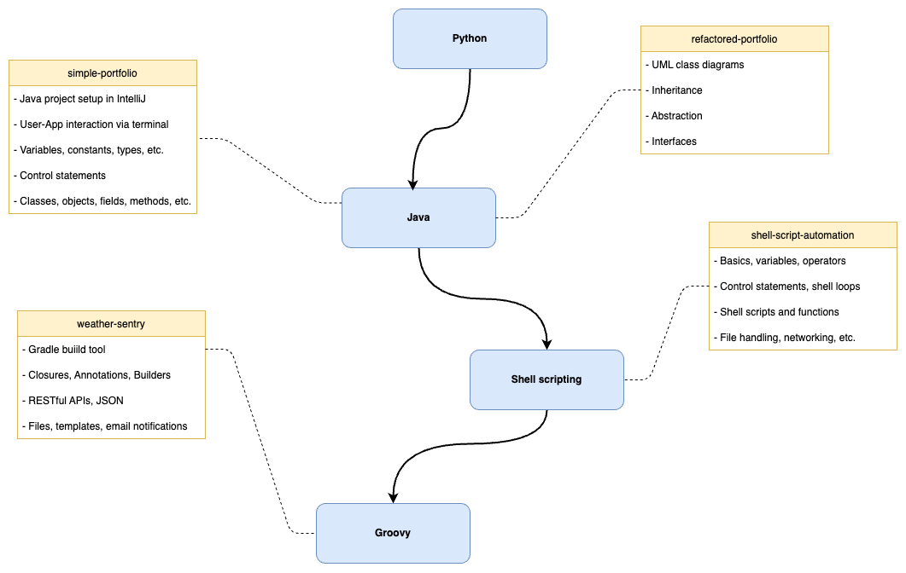

# software-architecture-journey

This repository aims to serve as a summary of topics that I believe are crucial for aspiring architects. It encompasses my personal approaches to learning about these subjects through the implementation of small projects and practical exercises.

---

## Table of contents:
- [The T-Profile](#the-t-profile)
- [Programming & Scripting](#programming-and-scripting)
- [Architecture Patterns & Software Design](#architecture-patterns-and-software-design)
- [Cloud Platforms](#cloud-platforms)

---

## The T-Profile

The T-Profile visualizes my concept of a software architect's skill profile. The horizontal bar of the "T" represents the breadth of knowledge that a software architect should possess. It signifies the ability to comprehend and integrate multiple areas within information technology, such as software development methodologies, system architecture, security, databases, networking, and user experience design. The vertical bar of the "T" symbolizes the depth of expertise in a specific domain. Architects focus on acquiring advanced knowledge and skills in one particular area, becoming specialists in fields like cloud computing, mobile applications, artificial intelligence, data analytics, or enterprise systems.

By combining breadth and depth, the T-Profile represents a well-rounded software architect. They possess the ability to comprehend the bigger picture of software systems while also providing expert guidance in a specific domain.

The following sections will provide an overview of the projects, exercises, and other resources that I have engaged with to enhance my understanding of specific domains. 

## Programming & Scripting
Having programming basics as a software architect is important because it provides a fundamental understanding of the underlying technology, enabling effective communication with developers, accurate assessment of technical feasibility, and informed decision-making in architectural designs.

The diagram shows some projects that i worked on and summarizes how they contributed to me gaining a better understanding of the respective domain.

- https://github.com/mykingdomforapawn/simple-portfolio
- https://github.com/mykingdomforapawn/refactored-portfolio

## Architecture Patterns & Software Design

## Cloud Platforms

## Resources
- https://github.com/giulianopz/java-be-learning-path
- https://github.com/s4kibs4mi/java-developer-roadmap