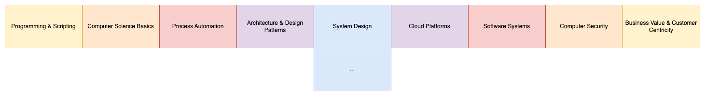

# software-architecture-journey

> This repository contains a broad overview of focus topics in my software architecture journey.

This simple project lets the user interact with a java application in the terminal to set up and play around with a combination of a savings account and a stock portfolio account.

---

## Table of contents:
- [The T-Profile](#the-t-profile)
- [Programming](#programming)

---

## Software Architecture Profile

Some text.

## Programming

## 

## Further resources

- https://github.com/giulianopz/java-be-learning-path
- https://github.com/s4kibs4mi/java-developer-roadmap

